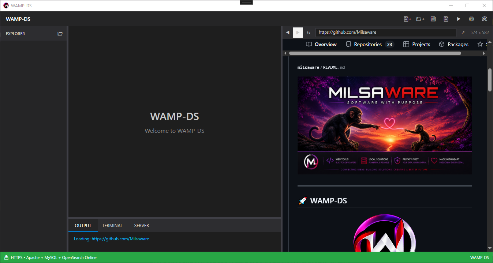

# Development Entry #08 - Embedded Live Preview Browser Controls

**Date:** 18 August 2026  
**Area:** Live Preview / Developer Experience  
**Type:** Feature / Enhancement  
**Status:** Complete

---

## The Problem

The WAMP-DS Live Preview already provided an embedded browser for viewing projects.

However, it was still behaving more like a preview window than a browser.

The preview could display a page, but there was no way to navigate backwards or forwards, refresh the current page through the interface, or directly enter another URL.

The browser was embedded.

The controls were not.

That made the preview feel slightly incomplete when working with real-world projects.

---

## Improving The Preview

The Live Preview header was expanded to provide a small set of familiar browser controls.

The new layout contains:

- Back
- Forward
- Refresh
- URL bar
- Open in external browser
- Preview dimensions

The intention was not to turn WAMP-DS into a full web browser.

The intention was simply to make the embedded preview behave naturally when navigating websites and local development projects.

---

## Adding Browser Navigation

Three controls were added for basic browser navigation.

```xml
<!-- Back -->
<Button x:Name="PreviewBackButton"
        Content="◀"
        Width="28"
        Height="28"
        Background="Transparent"
        BorderThickness="0"
        Foreground="#CCCCCC"
        ToolTip="Back"
        Click="PreviewBackButton_Click"/>

<!-- Forward -->
<Button x:Name="PreviewForwardButton"
        Content="▶"
        Width="28"
        Height="28"
        Background="Transparent"
        BorderThickness="0"
        Foreground="#CCCCCC"
        ToolTip="Forward"
        Click="PreviewForwardButton_Click"/>

<!-- Refresh -->
<Button x:Name="PreviewRefreshButton"
        Content="↻"
        Width="30"
        Height="28"
        Background="Transparent"
        BorderThickness="0"
        Foreground="#CCCCCC"
        ToolTip="Refresh"
        Click="PreviewRefreshButton_Click"/>
```

These controls provide the expected browser navigation behaviour without requiring the developer to leave the WAMP-DS workspace.

The embedded WebView2 control already provides the underlying navigation functionality.

WAMP-DS simply exposes it through its own interface.

---

## Adding The URL Bar

The most significant addition was a URL bar.

```xml
<TextBox x:Name="PreviewUrlTextBox"
         Grid.Column="1"
         Height="24"
         Margin="4,0,4,0"
         VerticalAlignment="Center"
         Padding="6,2"
         Background="#1E1E1E"
         BorderBrush="#3F3F46"
         BorderThickness="1"
         Foreground="#CCCCCC"
         CaretBrush="White"
         FontSize="12"
         KeyDown="PreviewUrlTextBox_KeyDown"/>
```

This allows a developer to enter a URL directly into the embedded preview.

Pressing Enter can then navigate the WebView2 instance to the requested address.

This changes the role of the preview slightly.

It is no longer simply:

```text
Project
   ↓
Preview
```

It can now behave more naturally as:

```text
URL
   ↓
Embedded Browser
   ↓
Website
```

---

## Making The Preview Behave Like A Browser

The important part of this change was not simply adding buttons.

It was making the embedded preview feel like an actual browser.

The navigation flow now becomes:

```text
Open Preview
      ↓
View Page
      ↓
Navigate
      ↓
Back / Forward
      ↓
Refresh
      ↓
Enter Another URL
```

The developer can perform these actions without opening an external browser.

This keeps the testing workflow inside WAMP-DS.

---

## External Browser Support

An option was also added to open the current preview externally.

```xml
<Button x:Name="PreviewExternalButton"
        Grid.Column="2"
        Content="↗"
        Width="28"
        Height="28"
        Background="Transparent"
        BorderThickness="0"
        Foreground="#CCCCCC"
        ToolTip="Open in external browser"
        Click="PreviewExternalButton_Click"/>
```

This provides a simple escape hatch when the developer wants to view the page in their normal browser.

The embedded preview therefore remains useful for quick development and testing, while the external browser remains available when needed.

---

## Keeping The Preview Dimensions Visible

The existing preview dimensions were retained as part of the new header.

```xml
<TextBlock x:Name="PreviewDimensionsText"
           Grid.Column="3"
           Text="0 x 0"
           Foreground="#888888"
           VerticalAlignment="Center"
           Margin="6,0,10,0"/>
```

This continues to show the current dimensions of the preview area.

That is particularly useful when developing responsive layouts, as the developer can immediately see the available viewport size while working.

---

## The Resulting Preview Header

The Live Preview now provides a compact browser-style interface, with navigation controls, direct URL entry, external browser access and live preview dimensions.



The controls remain deliberately small so that the preview itself retains as much space as possible.

The header is there to support development rather than compete with it.

---

## Why This Matters

The change is relatively small, but it improves the relationship between the developer and the preview.

Previously, the preview was primarily something to look at.

Now it can be interacted with more naturally.

A developer can:

```text
Preview
   ↓
Navigate
   ↓
Refresh
   ↓
Inspect
   ↓
Change Code
   ↓
Save
   ↓
Refresh
   ↓
Continue
```

That makes the embedded browser feel much more like part of the development environment rather than a separate display area.

---

## Real-World Development Again

This improvement came from the same process that has driven several of the recent WAMP-DS changes.

The software is being used.

While working inside the application, small things become noticeable.

The thought was essentially:

> "I've got a browser sitting here. Why doesn't it behave like one?"

The answer was straightforward.

It should.

Rather than requiring the developer to open another application for basic navigation, WAMP-DS can provide those interactions directly inside the Live Preview.

---

## Verification

The Live Preview header was expanded and tested with the new browser controls.

The resulting interface provides:

```text
◀
Back

▶
Forward

↻
Refresh

URL
Direct navigation

↗
Open externally

800 x 500
Current preview dimensions
```

The existing embedded WebView2 remains responsible for displaying the content.

The new controls simply provide a more familiar interface around it.

---

## Result

The WAMP-DS Live Preview now behaves much more like an embedded browser.

It provides navigation controls, direct URL entry, refresh functionality and the ability to open the current page externally.

The preview remains integrated into the WAMP-DS workspace while providing the basic browser interactions expected when working with web content.

The result is a more complete development loop:

```text
Write Code
    ↓
Save
    ↓
Preview
    ↓
Navigate
    ↓
Refresh
    ↓
Inspect Result
    ↓
Write More Code
```

The browser is no longer just something displaying the result.

It has become another part of the development environment.

---

## The Bigger Picture

WAMP-DS is increasingly becoming a collection of tools that work together rather than a collection of separate features.

The project system provides the workspace.

The editor provides the code environment.

Apache and PHP provide the web server.

MySQL provides the database.

SSL provides HTTPS development.

And the Live Preview provides a browser directly inside that environment.

Adding browser controls is another small step towards making those pieces feel like one application.

The goal isn't to recreate a full browser inside WAMP-DS.

It is simply to remove unnecessary friction from the development process.

If a developer needs to go back, they can go back.

If they need to refresh, they can refresh.

If they need to visit another URL, they can type it.

And if they want the external browser, it is one click away.

Another small piece of the development workflow now happens without leaving WAMP-DS.

---

<p align="center">
<a href="../17/07.md"><strong>← Development Entry #07</strong></a>
&nbsp;&nbsp;|&nbsp;&nbsp;
<a href="./09.md"><strong>Development Entry #09 →</strong></a>
</p>