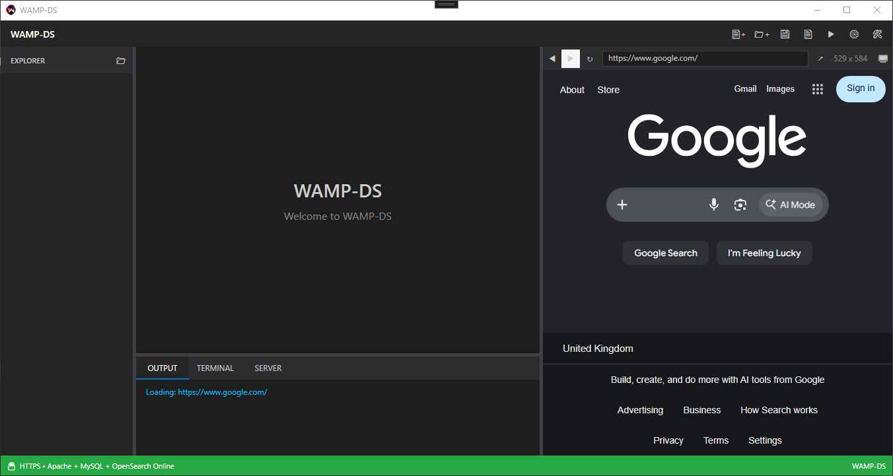
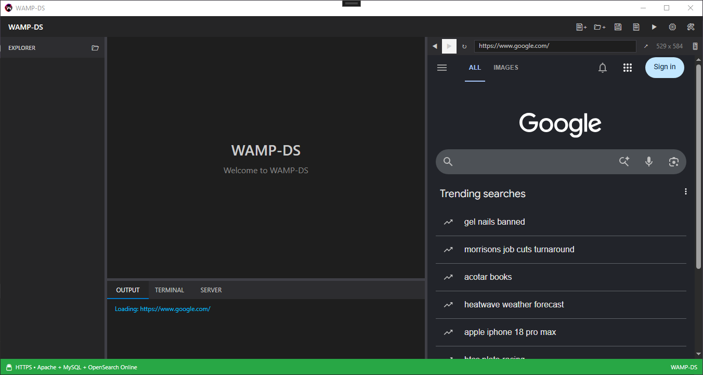

# Development Entry #09 - Mobile Live Preview Mode

**Date:** 18 August 2026  
**Area:** Live Preview / Responsive Development  
**Type:** Feature / Enhancement  
**Status:** Complete

---

## The Problem

The WAMP-DS Live Preview had now evolved into a small embedded browser.

It could navigate backwards and forwards, refresh pages, accept URLs directly and open pages externally.

However, there was still an important part of modern web development missing.

Responsive websites need to be tested at different device sizes and, in some cases, with different browser identification.

A page can behave differently when accessed from a desktop browser compared with a mobile device.

Until now, the WAMP-DS preview always presented itself as a desktop browser.

There was no simple way to switch between desktop and mobile behaviour.

---

## Adding Mobile Preview

A single toggle was added to the Live Preview header.

The button provides two states:

```text
Desktop
   ↓
📱
   ↓
Mobile
```

and:

```text
Mobile
   ↓
🖥
   ↓
Desktop
```

The important part is that the button is a toggle rather than two separate controls.

One click changes the current preview mode.

Another click changes it back.

This keeps the interface compact while making the functionality immediately accessible.

---

## The Mobile Toggle

The new control was added alongside the existing browser controls.

```xml
<!-- Mobile Preview Toggle -->
<Button x:Name="MobilePreviewButton"
        Grid.Column="4"
        Content="🖥"
        Width="28"
        Height="28"
        Background="Transparent"
        BorderThickness="0"
        Foreground="#CCCCCC"
        ToolTip="Desktop Preview"
        Click="MobilePreviewButton_Click"/>
```

The preview starts in desktop mode.

The icon therefore represents the current state of the preview.

When mobile mode is enabled, the icon changes to represent the mobile state.

This makes the current mode visible without requiring another status indicator.

---

## Changing The Browser Identity

The toggle does more than change the appearance of the button.

When mobile mode is enabled, the embedded WebView2 browser is configured with a mobile user agent.

This allows websites to identify the preview as a mobile browser.

The basic flow becomes:

```text
Desktop Mode
      ↓
Desktop User Agent
      ↓
Website sees desktop browser
```

or:

```text
Mobile Mode
      ↓
Mobile User Agent
      ↓
Website sees mobile browser
```

The actual page is still being displayed by the same embedded WebView2 instance.

The difference is how the browser identifies itself to the website.

---

## Switching Between Modes

The mobile button acts as a simple toggle.

The current state is tracked by WAMP-DS and the WebView2 user agent is updated when the state changes.

The behaviour is effectively:

```text
Current Mode: Desktop
        ↓
     Click 📱
        ↓
Current Mode: Mobile
        ↓
Mobile User Agent
```

and:

```text
Current Mode: Mobile
        ↓
     Click 🖥
        ↓
Current Mode: Desktop
        ↓
Desktop User Agent
```

This keeps the operation simple for the developer.

There is no settings window to open.

There is no device selection dialog.

There is no separate preview window.

The mode can be changed directly from the Live Preview header.

---

## From Desktop ...

The preview initially operates normally as a desktop browser.



The page is loaded using the normal desktop browser identity.

The developer can work with the preview exactly as before.

---

## To Mobile ...

Clicking the mobile toggle changes the browser identity to a mobile user agent.



The same embedded browser is now presenting itself to websites as a mobile device.

The change can therefore be made without leaving the WAMP-DS workspace.

### In just one click

That is the important part.

```text
Desktop
   ↓
📱 Click
   ↓
Mobile
```

And back again:

```text
Mobile
   ↓
🖥 Click
   ↓
Desktop
```

---

## Why The User Agent Matters

Responsive websites do not always rely solely on viewport dimensions.

Some websites also use the browser's user agent to determine what type of device is accessing them.

A desktop browser may receive one version of a page.

A mobile browser may receive another.

By allowing WAMP-DS to change the browser identity, the Live Preview can test against both behaviours.

This provides another useful layer of responsive development testing without requiring a separate browser.

---

## Keeping The Existing Preview

The mobile mode does not replace the existing Live Preview.

The same WebView2 control remains responsible for displaying the page.

The same URL bar remains available.

The same navigation controls remain available.

The same refresh functionality remains available.

The only difference is the browser identity being presented to the website.

The workflow therefore remains familiar:

```text
Write Code
    ↓
Save
    ↓
Preview
    ↓
Switch Desktop / Mobile
    ↓
Inspect Result
    ↓
Change Code
    ↓
Continue
```

---

## Real-World Development Again

This feature came from the same process that has driven the recent Live Preview improvements.

The preview had already become a useful embedded browser.

Once it behaved like a browser, another obvious question appeared:

> "What if I want the website to think I'm on a phone?"

The answer was to make that another simple part of the preview.

There was no need to create a completely separate mobile preview system.

The browser already existed.

It simply needed another mode.

---

## Verification

The mobile toggle was added to the Live Preview header and tested by switching between desktop and mobile modes.

The initial state is desktop.

Clicking the toggle changes the browser to mobile mode.

Clicking it again returns the browser to desktop mode.

The browser identity changes with the selected mode.

The existing navigation and preview functionality continues to operate normally.

The resulting interaction is:

```text
Desktop Mode
     ↓
Click Mobile Toggle
     ↓
Mobile Mode
     ↓
Click Mobile Toggle
     ↓
Desktop Mode
```

The mode can therefore be changed at any point while using the embedded preview.

---

## Result

WAMP-DS Live Preview now supports a simple desktop/mobile browser toggle.

The developer can switch the embedded browser between desktop and mobile identification with a single click.

This makes it possible to test how websites respond to different browser identities without leaving WAMP-DS.

The Live Preview now provides:

```text
◀
Back

▶
Forward

↻
Refresh

URL
Direct navigation

↗
Open externally

📱 / 🖥
Desktop / Mobile

800 x 500
Current preview dimensions
```

The result is another small but useful improvement to the development workflow.

---

## The Bigger Picture

The Live Preview has changed considerably through a series of relatively small improvements.

It started as a way of displaying the current project.

It became an embedded browser.

It gained navigation.

It gained direct URL entry.

It gained external browser support.

And now it can identify itself as either a desktop or mobile browser.

None of these features individually changes the fundamental purpose of WAMP-DS.

Together, however, they make the preview considerably more useful for real-world development.

A developer can now work through much of the testing process without leaving the application.

```text
Write Code
    ↓
Save
    ↓
Preview
    ↓
Navigate
    ↓
Refresh
    ↓
Switch Desktop / Mobile
    ↓
Inspect
    ↓
Change Code
    ↓
Continue
```

The goal remains the same.

Remove unnecessary interruptions from the development workflow.

If a developer wants to test the desktop version, it is already there.

If they want the mobile browser experience, it is one click away.

Another small piece of the development process now happens directly inside WAMP-DS.

---

<p align="center">
<a href="./08.md"><strong>← Development Entry #08</strong></a>
<!-- &nbsp;&nbsp;|&nbsp;&nbsp;
<a href="./10.md"><strong>Development Entry #10 →</strong></a> -->
</p>