

  

<h1 align="center">WAMP-DS</h1>

  <strong>Web Application Multi-Purpose Development Sandbox</strong>

  <strong>A powerful local development factory for PHP developers.</strong>

WAMP-DS is an all-in-one Windows development environment designed to make building, testing and managing PHP applications easier.

It brings your development stack, projects, tools and workflows together in one place — giving you everything you need to build PHP applications without having to manually assemble and configure the environment yourself.

> **Click. Fill. Click. Create. Build.**

## Project Status

WAMP-DS is currently under active development.

The core development environment, project creation system, runtime management and installer are in place, with additional features and integrations continuing to be developed.

The first public alpha release is now available in the Releases section on the right.

## What is WAMP-DS?

WAMP-DS is a complete local development environment for Windows, built specifically for PHP developers.

It brings the tools, services and infrastructure needed to develop modern PHP applications together into a single workspace.

Instead of installing, configuring and managing each component separately, WAMP-DS takes care of the environment for you.

Apache, PHP, MySQL, OpenSearch, SSL, Composer and project configuration are all brought together under one application.

### A Development Factory

WAMP-DS isn't just another WAMP stack.

It's a development factory.

The idea is simple: the machinery underneath can be complicated, but using it shouldn't be.

WAMP-DS handles the repetitive and technical work involved in preparing a development environment, allowing you to concentrate on the application you're actually building.

Create a project, provide the details, and let WAMP-DS do the work.

> **The complexity hasn't disappeared. WAMP-DS handles it.**

## Everything You Need to Build

WAMP-DS brings the core components of a PHP development environment together into one application.

### Web Server

WAMP-DS includes Apache as the primary web server, with support for both HTTP and HTTPS development.

Apache configuration is managed by WAMP-DS, allowing projects to be configured without manually editing server configuration files.

### PHP

PHP is managed as part of the WAMP-DS environment, providing the runtime required to build and run PHP applications.

WAMP-DS handles PHP configuration and prepares the runtime for the project you're working on.

### MySQL

MySQL provides the database layer for your applications and is managed directly from the WAMP-DS workspace.

Start it, stop it and monitor its status without leaving the application.

### OpenSearch

OpenSearch provides search functionality for applications that require it, including Magento.

WAMP-DS manages the OpenSearch runtime alongside the rest of the development environment.

### SSL

HTTPS is built into the development environment rather than treated as an afterthought.

Simply click **Enable SSL** and WAMP-DS does the rest.

WAMP-DS automatically creates the required certificates, configures Apache and adds the certificates to the Windows trust store.

No manual certificate generation.

No configuration files to edit.

No Windows certificate management.

**Just enable SSL and carry on building.**

### Composer

Composer is integrated into the project creation process, allowing PHP dependencies to be installed and configured automatically when required.

### phpMyAdmin

Database management is available directly from WAMP-DS through the included phpMyAdmin environment.

---

Together, these components form the foundation of the WAMP-DS development factory.

You don't need to manage each one independently.

**WAMP-DS brings them together and manages the machinery for you.**

## Live Preview

WAMP-DS keeps your application close while you build.

The integrated live preview allows you to view your PHP application directly inside the development environment.

Every time you save your work, the preview is refreshed so you can immediately see the result.

No switching between your editor and browser.

No manually refreshing the page.

Just edit, save and see the changes.

**Write. Save. See. Repeat.**

## Project Creation

Creating a project shouldn't mean spending an hour preparing the environment before you can start writing code.

WAMP-DS puts project creation directly into the development workspace.

Click **Create New Project**, enter a few details, select the application or framework you want to use, and let WAMP-DS prepare everything for you.

Project creation can handle everything required to get the application running, including the project files, dependencies, runtime configuration, database configuration, web server configuration and SSL.

WAMP-DS automatically creates and configures the SSL certificates, configures HTTPS and makes the certificates trusted by Windows.

There is no manual SSL setup and no configuration required.

Create the project, let WAMP-DS do the work, and go straight to your new secure site.

Whether you're starting a simple PHP project or setting up a larger application such as Laravel, WordPress or Magento, WAMP-DS is designed to take care of the repetitive setup work.

### Create.

### Configure.

### Build.

**The project is ready. You are ready.**

## From Project Creation to a Running Magento Store

To demonstrate what WAMP-DS can do, let's walk through the process of creating and running a Magento project.

Magento is a powerful PHP application with a substantial installation process and a number of environment requirements.

With WAMP-DS, the developer doesn't need to manually configure those requirements.

The entire process can be completed from inside WAMP-DS.

### Step 1 — Create the Project

First, make sure Apache, MySQL and OpenSearch are running and SSL is enabled.

Click **Create New Project**, enter the project details, select **Magento**, and click **Create Project**.

  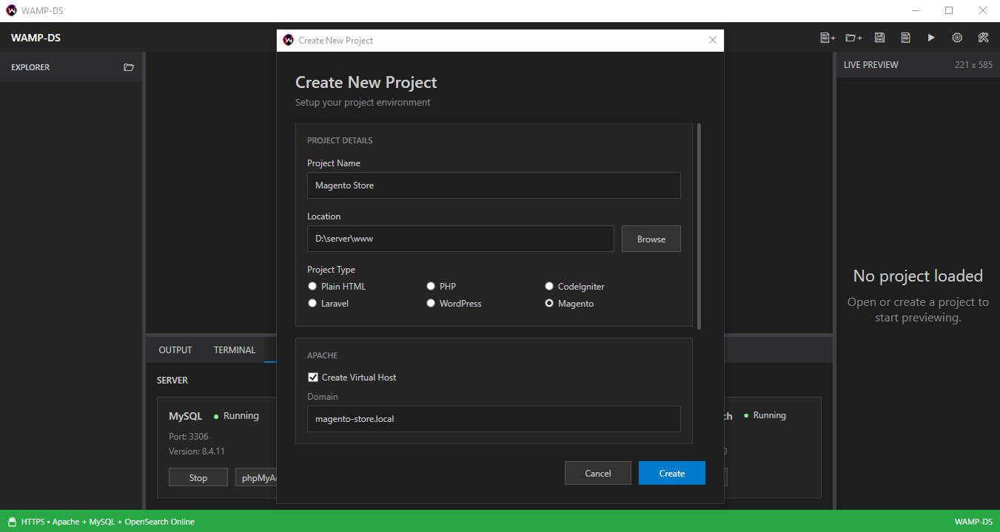

### Step 2 — Configure Magento

Enter the Magento admin installation settings.

  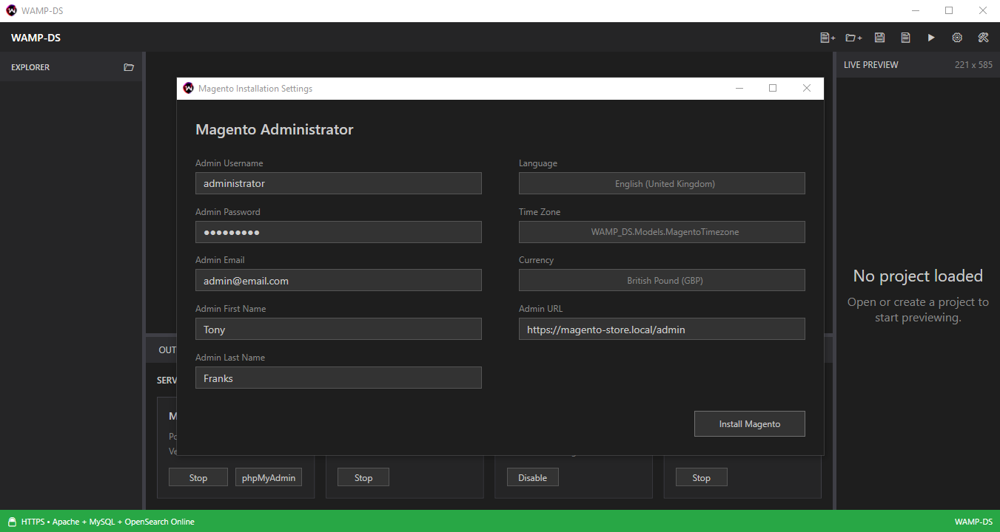

### Step 3 — Enter Magento Marketplace Credentials

Enter your Magento Marketplace credentials.

You only need to do this once.

WAMP-DS securely saves your credentials, so they are automatically available for future Magento installations.

No need to enter them again for every project.

  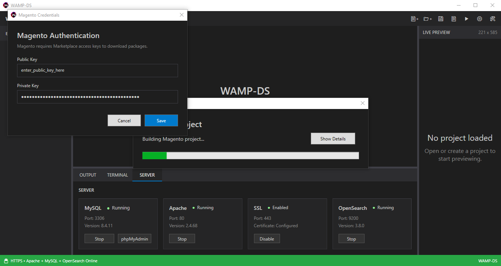

### Step 4 — Let WAMP-DS Do the Work

Once the configuration is complete, WAMP-DS takes over the installation.

Behind the scenes, WAMP-DS handles the work required to prepare the environment and install Magento.

This includes:

- Configuring `php.ini`
- Configuring Apache and `httpd.conf`
- Installing and running Composer
- Installing Magento and its dependencies
- Running the required Magento commands
- Applying Windows-specific patches
- Creating and configuring SSL certificates
- Adding certificates to the Windows trust store
- Configuring HTTPS
- Configuring the Windows hosts file
- Preparing the project environment

The developer doesn't need to perform any of these steps manually.

Just wait for WAMP-DS to finish.

  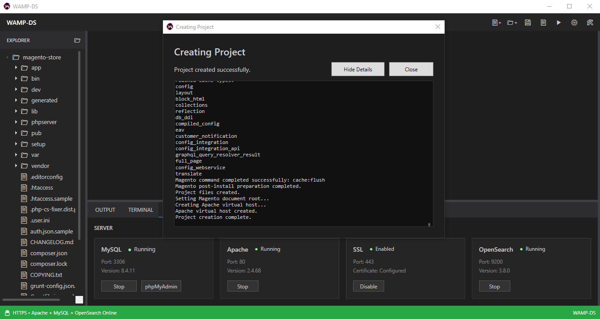

### Step 5 — Open Magento

Once the installation is complete, WAMP-DS provides everything needed to access the new project.

Open the new HTTPS address and Magento is ready to use.

  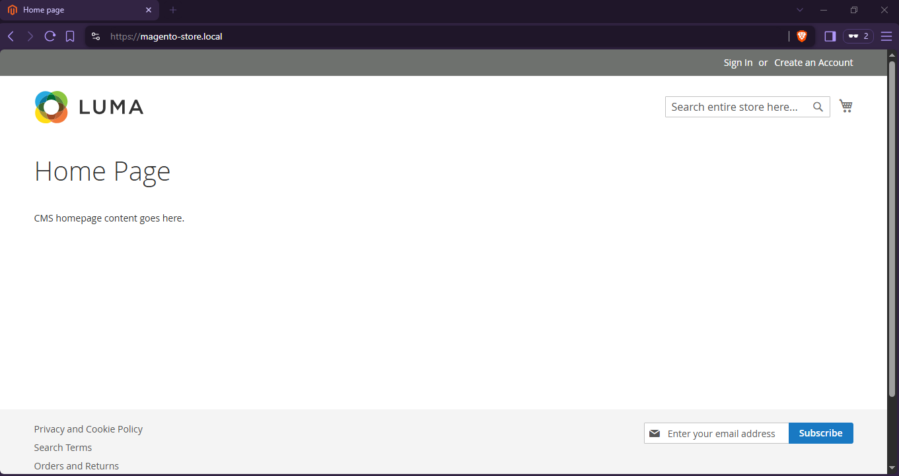

### Or Preview It Inside WAMP-DS

You can also preview your new site directly inside WAMP-DS using the docked live preview panel.

No need to switch applications or open a separate browser window.

  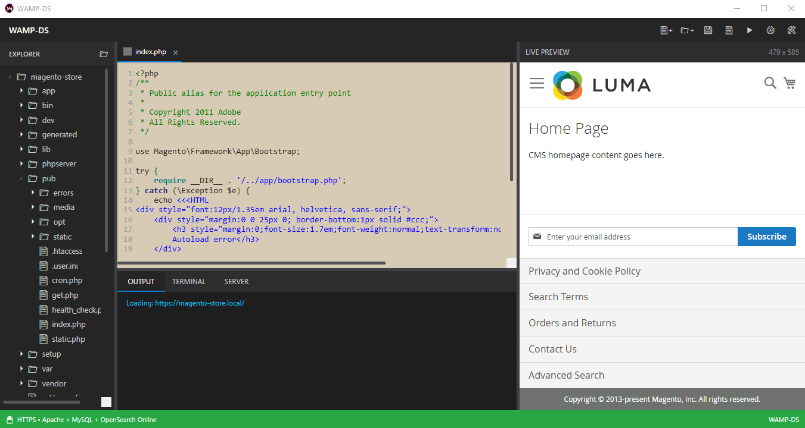

### The Result

From a new project to a fully configured Magento installation:

**Create → Configure → Wait → Build**

What would normally involve a substantial amount of manual configuration is handled by WAMP-DS automatically.

**You create the project. WAMP-DS builds the environment.**

## Frameworks & Applications

Magento is just one example of what WAMP-DS can do.

WAMP-DS is designed to support a range of PHP frameworks, CMS platforms and applications, with each project type having its own setup requirements handled automatically by the development environment.

Current project types include:

- Laravel
- CodeIgniter
- WordPress
- Magento

Each project type can have its own dedicated creation and configuration process, allowing WAMP-DS to handle the specific requirements of the application rather than forcing every project through the same generic setup.

As WAMP-DS grows, additional frameworks, CMS platforms and PHP applications can be added to the factory.

### One environment.

### Multiple applications.

### One simple workflow.

## The WAMP-DS Workspace

WAMP-DS brings the development workflow into a single workspace.

Instead of moving between separate applications to edit code, manage servers, preview your project and monitor what's happening, everything is available from within WAMP-DS.

  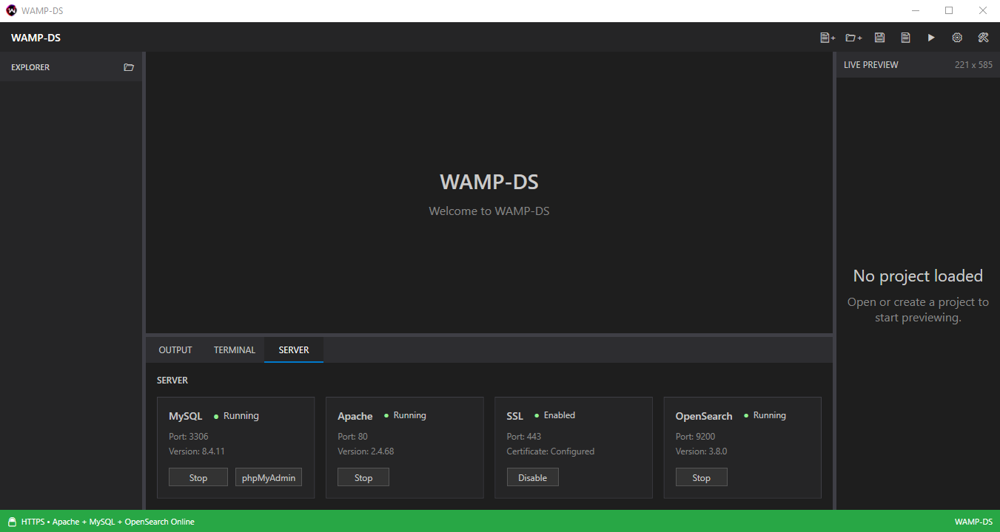

### Project Explorer

Browse your project files and folders directly from the integrated project explorer.

### Code Editor

Open and edit your project files without leaving WAMP-DS.

### Live Preview

Preview your application directly inside the workspace, with the preview updating after each save.

### Server Management

Start, stop and monitor the services your project requires.

### Output

View application and system output while you work.

**Code. Configure. Preview. Build.**

## Server Management

WAMP-DS puts your development services under one roof.

Apache, MySQL and OpenSearch can be started, stopped and monitored directly from the WAMP-DS workspace.

  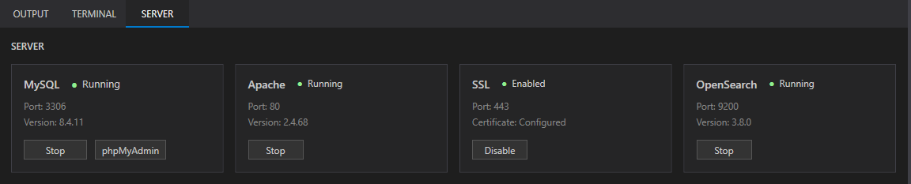

Each service has its own status, allowing you to see at a glance what is running and what isn't.

There is no need to open separate control panels or manage each service independently.

Start the services you need, create your project and get to work.

### Apache

Your web server, including HTTP and HTTPS development.

### MySQL

Your database server, ready for PHP applications and frameworks.

### OpenSearch

Search infrastructure for applications that require it, including Magento.

**Your services. Your project. One workspace.**

## SSL Made Simple

HTTPS shouldn't require you to become an SSL administrator.

WAMP-DS makes local HTTPS a one-click operation.

Click **Enable SSL** and WAMP-DS takes care of the rest.

It automatically:

- Creates the required SSL certificates
- Configures Apache for HTTPS
- Installs the certificates into the Windows trust store
- Configures the development environment for secure connections

There are no certificates to create manually.

No configuration files to edit.

No Windows certificate management.

Just click **Enable SSL**.

  

Your local applications can then be accessed securely over HTTPS without any additional setup.

**One click. Secure development.**

## Build Your Application

Once your project is ready, WAMP-DS gives you everything you need to start building.

The integrated code editor lets you work directly with your project files without leaving the development environment.

Open a file, make your changes, save, and see the result immediately in the live preview.

  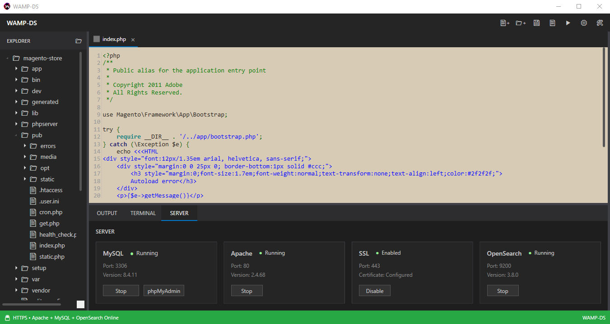

WAMP-DS is designed around a simple development loop:

    Edit
      ↓
    Save
      ↓
    Preview
      ↓
    Repeat

With the integrated explorer, editor, output panel and live preview all available from the same workspace, the tools you need are always close by.

**Less switching. More building.**

## Integrated Output

The WAMP-DS Output panel keeps development messages in one place.

It can capture messages from your application, including JavaScript console output, allowing you to see what's happening while you build without constantly switching to browser developer tools.

Use `console.log()`, warnings and other JavaScript messages while developing, and WAMP-DS can surface them directly in the integrated Output panel.

  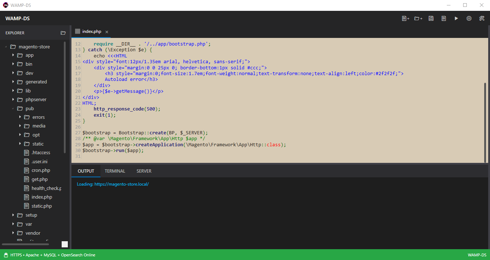

This gives you another simple development loop:

    Write
      ↓
    Run
      ↓
    See the message
      ↓
    Fix
      ↓
    Repeat

Your code, your messages and your development environment - all in one place.

## Why WAMP-DS?

Setting up a PHP development environment can involve a surprising amount of manual work.

Installing runtimes.

Configuring PHP.

Configuring Apache.

Setting up databases.

Installing Composer dependencies.

Creating SSL certificates.

Configuring HTTPS.

Updating the Windows hosts file.

Installing and configuring individual applications.

None of these things are the reason you started developing.

You started because you wanted to build something.

WAMP-DS is designed to move that repetitive infrastructure work into the development environment itself.

Instead of spending time preparing the factory, you can get straight to building inside it.

### Less Configuration

Let WAMP-DS handle the environment setup.

### Less Switching

Keep your project, editor, servers, preview and development tools together.

### Less Repetition

Automate the setup that would otherwise have to be performed for every project.

### More Building

Spend your time developing the application rather than preparing the environment.

> **The factory handles the machinery. You build the software.**

## Installation

WAMP-DS is currently distributed as a ZIP package containing the WAMP-DS installer.

Download the latest release, extract the ZIP package and run `WAMP-DS.Installer.exe`.

The installer will guide you through setting up WAMP-DS and installing the required components.

### Getting Started

1. Download the latest WAMP-DS release.
2. Extract the ZIP package.
3. Run `WAMP-DS.Installer.exe`.
4. Complete the installation.
5. Launch WAMP-DS.
6. Create your first project.

  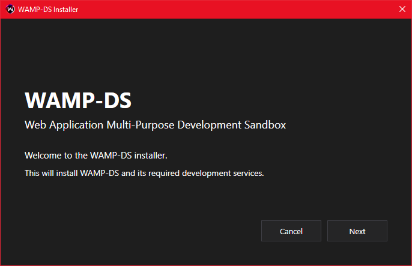

  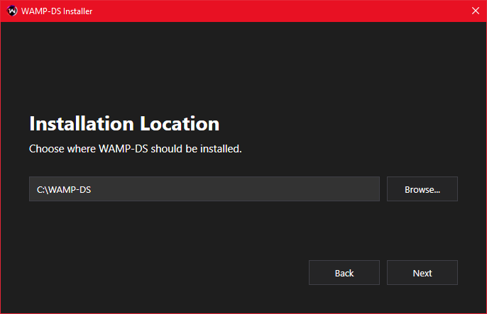

  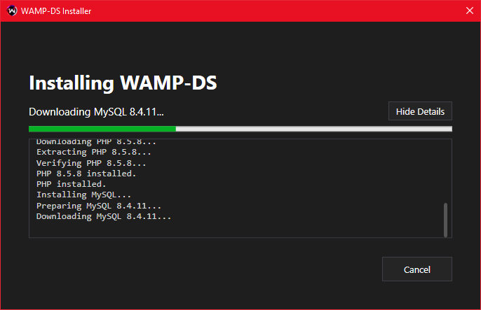

  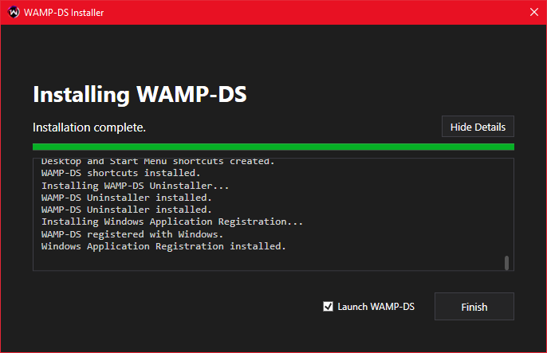

Once installed, WAMP-DS handles the configuration and setup of the development environment for you.

### Future Installer

The current release uses a ZIP package containing the installer.

Future releases will move to a lightweight executable bootstrapper that can download the latest WAMP-DS installation package and handle the installation automatically.

This will allow the bootstrapper itself to remain small while keeping the main installation package separate and updateable.

## Built with .NET

WAMP-DS is built as a native Windows desktop application using C# and .NET.

The application uses WPF to provide the development workspace and integrates the individual components of the WAMP-DS environment through a modular manager-based architecture.

### Core Technologies

- C#
- .NET 8
- WPF
- Apache
- PHP
- MySQL
- OpenSearch
- phpMyAdmin

### Modular Architecture

WAMP-DS separates the major parts of the development environment into dedicated managers.

This allows individual components to be controlled and developed independently while keeping the main application organised.

Examples include:

- Apache Manager
- MySQL Manager
- Project Manager
- Project Creation Manager
- Editor Manager
- Preview Manager
- SSL / Certificate Manager
- Framework-specific Managers

The result is an architecture where the development environment can grow without turning the application into one large monolithic system.

The factory can add new machinery without rebuilding the entire factory.

## 🗺️ Roadmap

WAMP-DS is actively being developed.

The foundation is in place, but the factory is still growing. Future development will focus on expanding the tools, automation and applications that can be managed through WAMP-DS.

### Development Tools

- [ ] Integrated terminal
- [ ] Expanded editor functionality
- [ ] Additional development utilities

### Project Support

- [ ] Additional PHP frameworks
- [ ] Additional CMS platforms
- [ ] Additional PHP applications
- [ ] More automated project configuration

### Runtime Management

- [ ] Additional PHP versions
- [ ] Additional database engines
- [ ] Additional development services
- [ ] Runtime management and updates

### Deployment & Operations

- [ ] Project backup and restore
- [ ] Deployment tooling
- [ ] Cloud integrations
- [ ] Additional environment automation

The roadmap will evolve as WAMP-DS develops.

New ideas, improvements and contributions can help shape what gets built next.

## Contributing

WAMP-DS is an evolving project, and contributions are welcome.

Whether you've found a bug, have an idea for a new feature, have improved an existing feature or simply want to help make WAMP-DS better, your contribution can help shape the project.

### Found a Bug?

If something isn't working as expected, please open an issue and provide as much detail as possible.

Include:

- What you were trying to do
- What happened
- What you expected to happen
- Any error messages or output
- Your WAMP-DS version
- Any other information that may help reproduce the problem

Screenshots and logs are always useful.

### Have an Idea?

Feature ideas and improvements are welcome.

Open an issue describing what you'd like to see, why it would be useful and how you think it could improve the WAMP-DS development experience.

### Want to Contribute Code?

Pull requests are welcome.

You can contribute bug fixes, improvements, new features, documentation or anything else that helps move the project forward.

Before starting a larger change, opening an issue first is recommended so the idea can be discussed before development begins.

### Recognition

Contributions to WAMP-DS are not intended to disappear into a commit history.

Significant contributions, fixes and improvements will be documented as part of the project's development history, giving credit to the people who helped make WAMP-DS better.

The goal is to build more than just a piece of software.

**Build it. Improve it. Leave your mark.**

## Project History

WAMP-DS is built in the open.

As the project develops, significant bugs, improvements, discoveries and contributions will be documented here.

Rather than simply recording what changed, the history will explain how problems were encountered, how they were solved and who helped solve them.

Each significant contribution can become part of the project's story.

This means the repository becomes more than a collection of source code.

It becomes a record of how WAMP-DS was built.

## Requirements

WAMP-DS is designed for Windows development environments.

### Supported Platform

- Windows 10
- Windows 11

### Requirements

- 64-bit Windows
- Sufficient disk space for WAMP-DS runtimes and projects
- Administrator privileges may be required during installation and environment configuration
